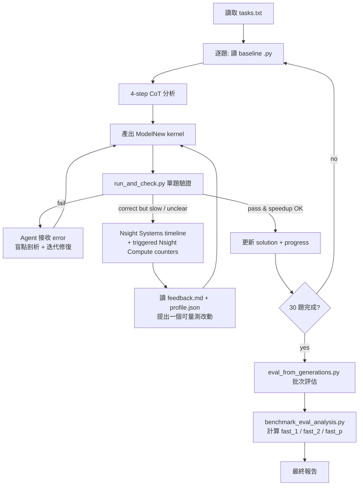

# Team 37 — Agent 工作流程 (Pipeline)

> 本文件說明 AI Agent 在本專題中如何處理 KernelBench 上 V100 特化的 30 題優化任務。
> 規範來源：[PROMPT.md](PROMPT.md)、題目清單：[tasks.txt](tasks.txt)

---

## 1. 專題目標 (一句話)
讓 LLM Agent 自動把 PyTorch 算子轉譯成 **V100 (Volta, CC 7.0) 特化** 的 CUDA / Triton kernel，並量測其相對於 PyTorch baseline 的加速比與正確性，探索 LLM 寫高效能 GPU kernel 的能力天花板。

## 2. 硬體與環境
- GPU：NVIDIA Tesla V100-SXM2-32GB (HBM2 ~900 GB/s)
- Stack：CUDA 12.8 / PyTorch (CUDA 12.1) / Triton 3.1
- 限制：**禁用** TF32、BF16 硬體加速、`cp.async`、Hopper/Ampere WGMMA 等指令；策略需特化 Volta。

環境建置：
```bash
./finalProject_260531/setup_env.sh
module load cuda
conda activate kernelbench
python ./finalProject_260531/check.py   # 確認 CUDA + Triton 正常
```

## 3. 題目集合 (固定 30 題)
- 來源：[tasks.txt](tasks.txt)
- 配置：Level 1 × 15 (單一算子)、Level 2 × 10 (算子融合)、Level 3 × 5 (端到端模型)
- Agent **不會再詢問** 要做哪些題，依 `tasks.txt` 順序處理。

## 4. Agent 單題工作流 (Chain of Thought, 嚴格 4 步)
針對清單中每一題，Agent 必須依序輸出：

1. **【算子特性分析】**
   讀 PyTorch baseline，判定 Compute-bound 或 Memory-bound、算術強度、資料形狀與型別。
2. **【記憶體與 Tiling 策略】**
   規劃 V100 上的 Block/Grid 切塊、Shared Memory 配置、register tiling、coalesced access pattern。
3. **【減少硬體衝突】**
   處理 Shared Memory Bank Conflict、Branch Divergence、ILP、warp 利用率。
4. **【核心實作】**
   產出 CUDA C++ 或 Triton 的 `ModelNew` 實作 (與 baseline 同 I/O 介面)。

> **禁止跳過分析直接貼程式碼**。

## 5. 全專案執行 Pipeline



## 6. 關鍵腳本對應 (KernelBench 內建)

| 用途 | 腳本 | 觸發時機 |
|------|------|----------|
| 環境健檢 | [check.py](check.py) | 初次/換機台 |
| 產生 V100 baseline 計時 | [scripts/generate_baseline_time.py](../scripts/generate_baseline_time.py) | **一次性**，跑 30 題前先建好 |
| 單題正確性 + 加速比 | [scripts/run_and_check.py](../scripts/run_and_check.py) | 每完成一題即跑 |
| Compute-node profiler feedback | [profile_feedback.py](profile_feedback.py) + [profile_feedback.sbatch](profile_feedback.sbatch) | correct but slow、效能回歸、或需要硬體證據 |
| 30 題批次評估 | [scripts/eval_from_generations.py](../scripts/eval_from_generations.py) | 全部 kernel 寫完後 |
| 計算 `fast_p` 總指標 | [scripts/benchmark_eval_analysis.py](../scripts/benchmark_eval_analysis.py) | 評估完出總表 |

> ⚠️ `results/timing/` 內目前只有 H100 的 baseline，**V100 baseline 必須自行產生**才能算正確的 speedup。

## 7. 評估指標
- **Correctness**：`torch.allclose()` 通過 (容差由 KernelBench 設定)。
- **Speedup**：`PyTorch baseline time / kernel time`，目標 > 1.0×，追求 ≥ 2× 甚至更高。
- **HBM Bandwidth Utilization**：Memory-bound 題目重點觀察。
- **fast_p**：正確且加速比 ≥ p 的題目比例 (`fast_1`, `fast_2`, …)。

## 8. 失敗回饋迴路
我（人類）會把以下其中一種貼回來，Agent 必須做盲點剖析後給出新版本：
- 編譯錯誤 (nvcc / Triton trace)
- `torch.allclose` 數值偏差
- Profiler / Nsight 數據 (頻寬未達標、占用率過低等)

> ⚠️ **執行環境陷阱（本次實驗紀錄）**：登入節點對每位使用者有 **20GB cgroup 記憶體上限**（非實體 RAM）。大 tensor 題目（如 P76 Conv1D dilated，host 端 input 8.6GB + output 5.7GB）在 `run_and_check.py` 於 host 建構輸入時即會觸發 cgroup OOM-killer，**連帶殺掉整個 user slice（含 ssh / tmux session）**。對策：(a) 用 **tmux** 跑評估避免 ssh 斷線連帶中斷；(b) **每題開獨立 subprocess** 逐一跑，避免一題 OOM 拖垮整批；(c) `systemd-run --user` 在此登入節點無 user D-Bus，無法用來做記憶體隔離。

## 9. Nsight-Guided Agent Feedback Pipeline

### 9.1 使用目的

只看程式碼與單一 runtime，只能知道「慢」，未必能知道時間花在哪裡。
本 pipeline 將證據拆成兩層：

- **Nsight Systems (`nsys`)**：回答整個 forward 的 kernel timeline、kernel
  數量、CUDA API overhead、candidate/eager/compile 差異。
- **Nsight Compute (`ncu`)**：回答單一主要 kernel 內部的 SM throughput、
  memory throughput、occupancy、eligible warps、register/shared-memory 使用量。

Agent 必須先用 Systems 找出主要 kernel，再只對覆蓋至少 80% GPU time、
最多三個 kernel 收集 Compute counters。不要對所有 tiny kernels 做深度 replay。

### 9.2 工具與權限

GPU profiling **只能在 Slurm compute node** 執行，不可在 `un-ln01` 登入節點執行。
`profile_feedback.sbatch` 在 repo-local Nsight 不存在時會自動載入：

```bash
module load nvhpc-24.11_hpcx-2.20_cuda-12.6
```

已在 `gn1001.twcc.ai` / Tesla V100-SXM2-32GB 驗證：

- Nsight Systems `2024.6.1`
- Nsight Compute `2024.3.2`
- Non-admin hardware counters 可用，不需要 sudo 或管理員修改權限

先執行 doctor：

```bash
sbatch finalProject_260531/profile_feedback.sbatch doctor
```

成功條件：`compute_node=true`、GPU 名稱正確、`nsys/ncu available=true`、
`hardware_counters.available=true`。

### 9.3 標準執行命令

```bash
sbatch finalProject_260531/profile_feedback.sbatch profile \
  --level <L> --problem-id <P> \
  --solution finalProject_260531/solutions/level<L>/<NN>_<name>.py \
  --paths candidate,eager,compile \
  --deep
```

`profile` 會依序：

1. 先跑 5/5 correctness 與 CUDA-event timing；incorrect candidate 不 profile。
2. 在 capture range 外 warm up / compile。
3. 分離執行 candidate、eager、compile，使用相同 seed 與 input。
4. 用 Nsight Systems 收 timeline、CUDA API overhead、top kernels。
5. 選擇覆蓋至少 80% GPU time、最多三個 kernel/path。
6. `--deep` 時用 Nsight Compute 收集 SpeedOfLight、LaunchStats、Occupancy、
   MemoryWorkloadAnalysis、SchedulerStats。
7. 產生 agent-facing `feedback.md` 與完整 `profile.json`。

### 9.4 產出與閱讀順序

每次結果位於：

```text
results/profiles/L<level>_P<id>/<run-id>/
├── feedback.md                 # Agent 第一個要讀的摘要
├── profile.json                # 結構化 timing/timeline/counter/diagnosis
├── *_nsys.nsys-rep             # 可用 Nsight Systems GUI/CLI 深入檢查
├── *_nsys_cuda_gpu_kern_sum.csv
├── *_nsys_cuda_api_sum.csv
├── *_ncu_<N>.ncu-rep           # 選定 kernel 的完整 hardware report
└── *_ncu_<N>.csv               # raw metrics，保留 per-kernel 資料
```

建議閱讀：

1. `feedback.md`：correctness、speedup、primary diagnosis、優先動作。
2. `profile.json.paths.*.timeline`：比較三條 path 的 kernel 數與時間。
3. `profile.json.deep_profile.paths.*.summary.kernels`：看主要 kernel counters。
4. 需要更細證據時才打開 `.nsys-rep` / `.ncu-rep`。

### 9.5 Counter 解讀規則

- **Compute-bound**：compute throughput ≥ 70%，memory throughput < 50%。
- **Memory-bound**：memory throughput ≥ 70%，compute throughput < 50%。
- **Occupancy/latency-bound**：compute/memory 都 < 50%，且 occupancy < 40%
  或 eligible warps 很低。
- **Launch-bound**：大量短 kernel，或 CUDA API/launch overhead > 20%。
- **Library-dominated**：主要時間在 cuBLAS/cuDNN vendor kernel。

重要 guardrails：

- Occupancy、bandwidth utilization 等 rate metrics 必須保留 **per kernel**；
  絕對不可跨 kernel 相加。
- 低 occupancy 不一定是問題；若 compute pipeline 已接近飽和，降低 register
  使用量可能反而讓 kernel 變慢。
- Near-peak cuBLAS GEMM 不應用 naive Triton 重寫。
- Profiler timing 含 replay overhead；正式速度仍以 CUDA-event evaluator 為準。
- 每次只根據 evidence 做一個 scoped change，修改後重新跑 correctness/timing。

### 9.6 已驗證案例

**L3/P1 MLP**

- Systems：3 個 `volta_sgemm_128x128_tn` 佔約 99.6% GPU timeline；
  CUDA API overhead 約 1.3%。
- Compute：主要 SGEMM 約 93.8% SM throughput、39.4% memory throughput、
  FMA pipeline 約 93.8%、occupancy 約 24.9%。
- 結論：compute-bound + library-dominated；不要手寫 GEMM。使用
  `max-autotune-no-cudagraphs` 選 library path，達 1.03× compile。

**L3/P48 Mamba2**

- Baseline timeline：candidate 42 kernels，compile 17 kernels。
- Profiler 指出大量重複 parameter-only copies/elementwise/contractions。
- 保留數值敏感的 eager contraction order，快取固定 A/B/C intermediates。
- Final candidate 16 kernels、16.0 ms，達 1.03× compile。

### 9.7 已修正的 Pipeline 陷阱

- Batch job 未載入 HPC SDK module，曾誤判 `nsys/ncu` 不存在。
- Nsight Systems CSV 在 header 前包含 status/NOTICE 文字；parser 現在會找真正
  `Time (%)` header。
- Nsight Compute `--export` stdout 只有狀態訊息；pipeline 現在會再以
  `ncu --import <report> --csv --page raw` 解碼 `.ncu-rep`。
- Raw NCU CSV 是 wide format；parser 會保留完整 per-kernel raw metrics，
  並抽取固定欄位供 deterministic diagnosis。

## 10. 產出檔案規劃
```
finalProject_260531/
├── PROMPT.md          # Agent 指令規範
├── tasks.txt          # 30 題清單
├── PIPELINE.md        # 本文件
├── check.py / setup_env.sh / environment.yml
└── solutions/         # Agent 產出的 30 個 kernel
    ├── level1/
    ├── level2/
    └── level3/
```

---

**Agent 接手時應先讀最新 progress 與 profile feedback，再決定下一個可量測改動。**
