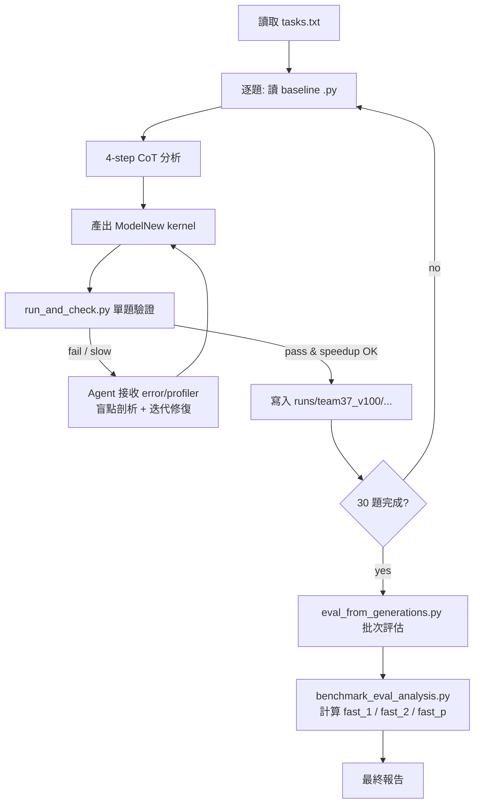

# Team 37 — Agent 工作流程 (Pipeline)

> 本文件說明 AI Agent 在本專題中如何處理 KernelBench 上 V100 特化的 30 題優化任務。
> 規範來源：[PROMPT.md](PROMPT.md)、題目清單：[tasks.txt](tasks.txt)

---

## 1. 專題目標 (一句話)
讓 LLM Agent 自動把 PyTorch 算子轉譯成 **V100 (Volta, CC 7.0) 特化** 的 CUDA / Triton kernel，並量測其相對於 PyTorch baseline 的加速比與正確性，探索 LLM 寫高效能 GPU kernel 的能力天花板。

## 2. 硬體與環境
- GPU：NVIDIA Tesla V100-SXM2-32GB (HBM2 ~900 GB/s)
- Stack：CUDA 12.8 / PyTorch (CUDA 12.1) / Triton 3.1
- 限制：**禁用** TF32、BF16 硬體加速、`cp.async`、Hopper/Ampere WGMMA 等指令；策略需特化 Volta。

環境建置：
```bash
./finalProject_260531/setup_env.sh
module load cuda
conda activate kernelbench
python ./finalProject_260531/check.py   # 確認 CUDA + Triton 正常
```

## 3. 題目集合 (固定 30 題)
- 來源：[tasks.txt](tasks.txt)
- 配置：Level 1 × 15 (單一算子)、Level 2 × 10 (算子融合)、Level 3 × 5 (端到端模型)
- Agent **不會再詢問** 要做哪些題，依 `tasks.txt` 順序處理。

## 4. Agent 單題工作流 (Chain of Thought, 嚴格 4 步)
針對清單中每一題，Agent 必須依序輸出：

1. **【算子特性分析】**
   讀 PyTorch baseline，判定 Compute-bound 或 Memory-bound、算術強度、資料形狀與型別。
2. **【記憶體與 Tiling 策略】**
   規劃 V100 上的 Block/Grid 切塊、Shared Memory 配置、register tiling、coalesced access pattern。
3. **【減少硬體衝突】**
   處理 Shared Memory Bank Conflict、Branch Divergence、ILP、warp 利用率。
4. **【核心實作】**
   產出 CUDA C++ 或 Triton 的 `ModelNew` 實作 (與 baseline 同 I/O 介面)。

> **禁止跳過分析直接貼程式碼**。

## 5. 全專案執行 Pipeline



## 6. 關鍵腳本對應 (KernelBench 內建)

| 用途 | 腳本 | 觸發時機 |
|------|------|----------|
| 環境健檢 | [check.py](check.py) | 初次/換機台 |
| 產生 V100 baseline 計時 | [scripts/generate_baseline_time.py](../scripts/generate_baseline_time.py) | **一次性**，跑 30 題前先建好 |
| 單題正確性 + 加速比 | [scripts/run_and_check.py](../scripts/run_and_check.py) | 每完成一題即跑 |
| 30 題批次評估 | [scripts/eval_from_generations.py](../scripts/eval_from_generations.py) | 全部 kernel 寫完後 |
| 計算 `fast_p` 總指標 | [scripts/benchmark_eval_analysis.py](../scripts/benchmark_eval_analysis.py) | 評估完出總表 |

> ⚠️ `results/timing/` 內目前只有 H100 的 baseline，**V100 baseline 必須自行產生**才能算正確的 speedup。

## 7. 評估指標
- **Correctness**：`torch.allclose()` 通過 (容差由 KernelBench 設定)。
- **Speedup**：`PyTorch baseline time / kernel time`，目標 > 1.0×，追求 ≥ 2× 甚至更高。
- **HBM Bandwidth Utilization**：Memory-bound 題目重點觀察。
- **fast_p**：正確且加速比 ≥ p 的題目比例 (`fast_1`, `fast_2`, …)。

## 8. 失敗回饋迴路
我（人類）會把以下其中一種貼回來，Agent 必須做盲點剖析後給出新版本：
- 編譯錯誤 (nvcc / Triton trace)
- `torch.allclose` 數值偏差
- Profiler / Nsight 數據 (頻寬未達標、占用率過低等)

## 9. 產出檔案規劃 (建議)
```
finalProject_260531/
├── PROMPT.md          # Agent 指令規範
├── tasks.txt          # 30 題清單
├── pipeline.md        # 本文件
├── check.py / setup_env.sh / environment.yml
└── solutions/         # Agent 產出的 30 個 kernel
    ├── level1/
    ├── level2/
    └── level3/
```

---

**Pipeline 簡介到此。Agent 已可直接從 `tasks.txt` 第 1 題 (`KernelBench/level1/6_Matmul_with_large_K_dimension_.py`) 開始動工。**
